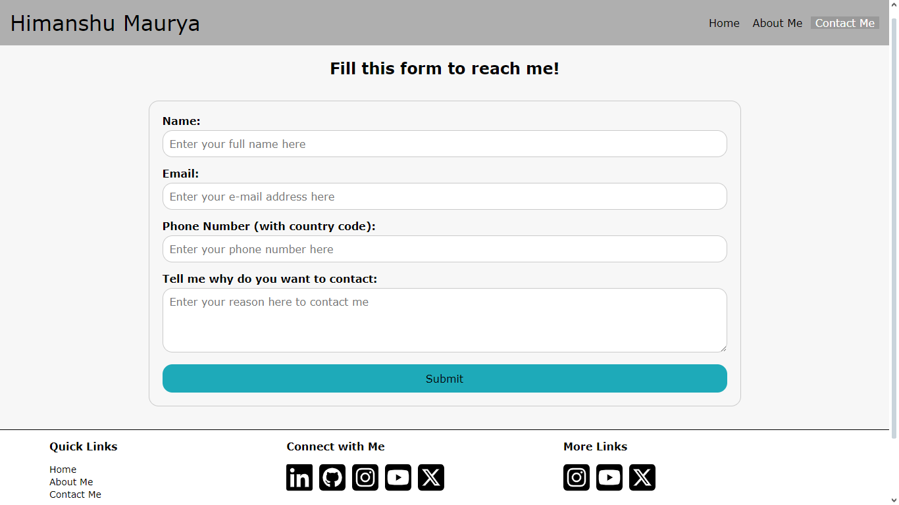

# Himanshu Maurya - Personal  Portfolio Website

This website serves as a portfolio showcasing Himanshu Maurya's skills, projects, and contact information.

## Table of Contents

- [Introduction](#introduction)
- [Features](#features)
- [Project_Images](#project_images)
- [Installation](#installation)
- [Usage](#usage)
- [Contributing](#contributing)
- [Author](#author)

## Introduction

This project contains the source code for Himanshu Maurya's personal website. It includes HTML, CSS, and JavaScript files that collectively form the website.
## Features

- **Navigation Menu:** A navigation menu is provided at the top of each page, allowing users to easily navigate between different sections of the website.
- **About Me Section:** This section provides a brief introduction to Himanshu Maurya, highlighting his education, skills, and interests.
- **Contact Me Form:** A contact form is available for visitors to reach out to Himanshu Maurya directly.
- **Social Media Integration:** Links to Himanshu Maurya's social media profiles are provided, allowing visitors to connect with him on various platforms.
- **Footer:** The footer section contains quick links, social media links, and copyright information.

## Project_Images

## Installation

To run the website locally, follow these steps:

1. Clone this repository to your local machine.
2. Navigate to the `PRODIGY_WD_04/html` folder.
3. Open `index.html` file in your web browser.
   
## Usage

Feel free to explore the website to learn more about Himanshu Maurya, his projects, and how to contact him. You can navigate between different sections using the navigation menu, fill out the contact form to send a message directly to Himanshu Maurya, and click on the social media icons in the footer to connect with him on various platforms.

## Contributing

Contributions to this project are welcome! If you'd like to contribute, please follow these steps:

- Fork the repository and create your branch.
- Make your changes and test them thoroughly.
- Commit your changes and push to your fork.
- Create a pull request with a detailed description of your changes.

## Author

Himanshu Maurya
